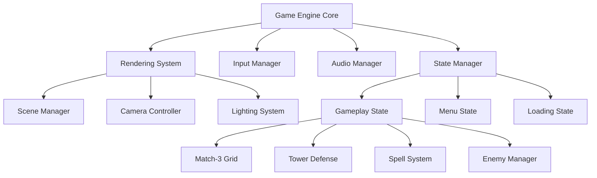

# Design Document

## Overview

This design document outlines the architecture for a browser-based match-3 tower defense game that combines puzzle mechanics with strategic defense gameplay. The game leverages WebGL and Three.js for high-performance 3D graphics while maintaining compatibility across desktop and mobile browsers. The design is structured around three core pillars: engaging gameplay mechanics, cohesive visual presentation, and intuitive user experience.

## Architecture

### Technical Stack
- **Rendering Engine**: Three.js with WebGL backend, Canvas 2D fallback
- **Game Engine**: Custom lightweight engine built on Three.js
- **Audio**: Web Audio API with fallback to HTML5 Audio
- **Input**: Unified input system supporting mouse, touch, and keyboard
- **State Management**: Finite State Machine for game states
- **Performance**: Object pooling, frustum culling, and LOD systems

### Core Systems Architecture



## 1. Gameplay-Related Design

### Match-3 Grid System

**Core Mechanics**:
- 8x8 grid with 5 gem types (Fire, Water, Nature, Light, Shadow)
- Swap-based matching with gravity simulation
- Cascade detection for chain reactions
- Special gems created from 4+ matches

**Grid Architecture**:
```javascript
class GridSystem {
  - gems: Gem[][]
  - matchDetector: MatchDetector
  - gravitySimulator: GravitySimulator
  - cascadeHandler: CascadeHandler
}
```

**Match Detection Algorithm**:
1. Scan horizontal and vertical lines after each swap
2. Mark connected gems of same type (3+ in line)
3. Calculate match scores with multipliers
4. Generate mana based on gem types and match size

### Tower Defense Integration

**Battlefield Layout**:
- 3D isometric view with predefined enemy paths
- Spell casting zones overlaid on the battlefield
- Visual connection between match-3 grid and battlefield effects

**Enemy Wave System**:
- Wave-based spawning with increasing difficulty
- Enemy types with different resistances to mana types
- Boss enemies requiring specific spell combinations

**Spell Casting Mechanics**:
- Mana accumulation from gem matches
- Spell targeting system with area-of-effect visualization
- Cooldown management and mana cost balancing

### Progression System

**Player Advancement**:
- Experience points from enemy defeats and wave completion
- Spell unlock tree with branching paths
- Gem crafting system for enhanced effects

**Difficulty Scaling**:
- Dynamic enemy health and speed increases
- New enemy types introduced progressively
- Environmental hazards in later levels

## 2. Visual Bible

### Entity Design

**Gem Aesthetics**:
- **Fire Gems**: Ruby-red crystals with internal flame particles
- **Water Gems**: Sapphire-blue with flowing liquid effects
- **Nature Gems**: Emerald-green with leaf and vine motifs
- **Light Gems**: Golden-yellow with radiant glow effects
- **Shadow Gems**: Deep purple with dark energy wisps

**Special Gem Effects**:
- **Power Gems**: Larger size with pulsing energy aura
- **Bomb Gems**: Crackling energy with explosive particles
- **Lightning Gems**: Electric arcs between facets

**Enemy Design Philosophy**:
- Fantasy creatures inspired by Kingdom Rush aesthetics
- Clear visual indicators for enemy types and resistances
- Readable silhouettes for mobile gameplay

**Environment Art Style**:
- Hand-painted textures with stylized realism
- Warm color palette with high contrast for readability
- Modular tile system for varied battlefield layouts

### UI Design Language

**Interface Principles**:
- Medieval fantasy theme with ornate borders and frames
- High contrast text and icons for mobile readability
- Consistent iconography across all game systems

**HUD Layout**:
- Mana bars positioned for thumb accessibility on mobile
- Spell buttons with clear cooldown indicators
- Health and score displays in non-intrusive corners

**Menu Design**:
- Parchment and wood textures for authentic fantasy feel
- Animated transitions with magical particle effects
- Responsive layout adapting to screen orientation

### VFX System

**Match Effects**:
- Gem destruction with type-appropriate particles
- Cascade multiplier effects with screen shake
- Mana collection animations flowing to UI elements

**Spell Effects**:
- Fireball: Projectile trail with explosion and burn damage over time
- Ice Shard: Freezing effect with crystalline impact
- Lightning: Chain lightning between enemies with electric arcs
- Healing: Gentle green particles with restoration glow
- Shadow Bolt: Dark energy with life-drain tendrils

**Environmental Effects**:
- Dynamic lighting responding to spell casts
- Weather effects for different battlefield themes
- Ambient magical particles for atmosphere

## 3. User Experience Design

### Input and Controls

**Desktop Experience**:
- Mouse hover states for all interactive elements
- Click and drag for gem swapping with visual feedback
- Keyboard shortcuts for power users (spell hotkeys)
- Right-click context menus for advanced options

**Mobile Experience**:
- Touch-optimized gem swapping with haptic feedback
- Gesture recognition for spell casting (tap to target)
- Adaptive UI scaling based on screen size and DPI
- Prevention of accidental touches during gameplay

**Accessibility Features**:
- Colorblind-friendly gem designs with shape differentiation
- Audio cues for important game events
- Scalable UI text and high contrast mode
- Reduced motion options for sensitive users

### Game Flow and Pacing

**Session Structure**:
- Quick 3-5 minute levels for mobile gaming sessions
- Progressive difficulty with clear milestone rewards
- Save system preserving progress between sessions
- Pause functionality with game state preservation

**Onboarding Experience**:
- Interactive tutorial introducing mechanics gradually
- Visual hints and tooltips for first-time players
- Practice mode with unlimited retries
- Achievement system encouraging exploration

**Feedback Systems**:
- Immediate visual and audio feedback for all actions
- Clear progress indicators for goals and objectives
- Satisfying reward animations for achievements
- Error prevention with confirmation dialogs for destructive actions

### Performance and Optimization

**Rendering Optimization**:
- Automatic quality adjustment based on device performance
- Object pooling for frequently created/destroyed objects
- Texture atlasing and compression for faster loading
- Frustum culling and LOD systems for complex scenes

**Memory Management**:
- Asset streaming for large textures and models
- Garbage collection optimization to prevent frame drops
- Preloading critical assets during loading screens
- Cleanup systems for unused resources

**Network Considerations**:
- Offline-first design with optional online features
- Progressive asset loading for faster initial startup
- Compressed asset formats optimized for web delivery
- Graceful degradation when network is unavailable

### Responsive Design Strategy

**Screen Adaptation**:
- Fluid layout system adapting to any screen ratio
- Dynamic UI element positioning based on safe areas
- Scalable vector graphics for crisp display at any resolution
- Orientation change handling with smooth transitions

**Device-Specific Optimizations**:
- High-DPI display support with appropriate asset scaling
- Battery usage optimization for mobile devices
- Thermal throttling detection and response
- Platform-specific input method support

## Components and Interfaces

### Core Game Components

```typescript
interface GameEngine {
  renderer: ThreeJSRenderer;
  inputManager: InputManager;
  audioManager: AudioManager;
  stateManager: StateManager;
  sceneManager: SceneManager;
}

interface Match3Grid {
  gems: Gem[][];
  detectMatches(): Match[];
  applyGravity(): void;
  generateNewGems(): void;
  calculateMana(matches: Match[]): ManaReward;
}

interface TowerDefense {
  enemies: Enemy[];
  spells: Spell[];
  battlefield: Battlefield;
  castSpell(spell: Spell, target: Vector3): void;
  spawnWave(waveConfig: WaveConfig): void;
}
```

## Data Models

### Game State Model
```typescript
interface GameState {
  level: number;
  score: number;
  health: number;
  mana: ManaPool;
  grid: GridState;
  enemies: EnemyState[];
  spells: SpellState[];
}

interface ManaPool {
  fire: number;
  water: number;
  nature: number;
  light: number;
  shadow: number;
}
```

## Error Handling

### Graceful Degradation
- WebGL fallback to Canvas 2D rendering
- Audio fallback from Web Audio API to HTML5 Audio
- Touch input fallback for unsupported gestures
- Network error handling with offline mode

### Performance Monitoring
- Frame rate monitoring with automatic quality adjustment
- Memory usage tracking with cleanup triggers
- Asset loading error recovery with retry mechanisms
- User feedback collection for optimization insights

## Testing Strategy

### Automated Testing
- Unit tests for game logic and algorithms
- Integration tests for system interactions
- Performance benchmarks across device types
- Cross-browser compatibility testing

### User Testing
- Usability testing on target devices
- Accessibility testing with assistive technologies
- Playtesting sessions for balance and fun factor
- A/B testing for UI and UX improvements