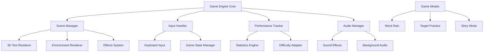

# Design Document

## Overview

The WebGL Typing Game is a browser-based 3D typing application built with Three.js that transforms traditional typing practice into an immersive 3D experience. The game features multiple game modes, real-time performance tracking, and adaptive difficulty scaling, all rendered in a responsive 3D environment.

## Architecture

### High-Level Architecture



### Technology Stack

- **Rendering Engine**: Three.js (WebGL abstraction)
- **Build Tool**: Vite (for fast development and optimized builds)
- **Language**: TypeScript (for type safety and better development experience)
- **Audio**: Web Audio API with Three.js PositionalAudio
- **Storage**: LocalStorage for user progress and settings
- **Testing**: Jest for unit tests, Playwright for integration tests

## Components and Interfaces

### Core Game Engine

```typescript
interface GameEngine {
  scene: THREE.Scene;
  camera: THREE.Camera;
  renderer: THREE.WebGLRenderer;
  
  initialize(): Promise<void>;
  startGame(mode: GameMode): void;
  pauseGame(): void;
  endGame(): GameResult;
  update(deltaTime: number): void;
}
```

### Scene Management

**SceneManager**: Handles 3D scene setup, lighting, and environment management
- Manages multiple environment themes (space, underwater, forest, etc.)
- Controls camera positioning and smooth transitions
- Handles dynamic lighting based on game events

**TextRenderer**: Manages 3D text objects in the scene
- Creates 3D text meshes using Three.js TextGeometry
- Handles text positioning, scaling, and animations
- Manages text materials and visual effects (glow, particles)

### Input System

**InputHandler**: Processes keyboard input and game state changes
- Captures keystrokes with minimal latency
- Handles special keys (backspace, space, enter)
- Manages input validation and error detection
- Supports multiple keyboard layouts

**GameStateManager**: Tracks current game state and transitions
- Manages game flow (menu → playing → paused → results)
- Handles mode-specific state logic
- Coordinates between different game systems

### Performance and Analytics

**PerformanceTracker**: Real-time typing metrics calculation
- Calculates WPM using sliding window approach
- Tracks accuracy with character-level precision
- Monitors typing rhythm and consistency
- Stores session data for historical analysis

**DifficultyAdapter**: Dynamic difficulty adjustment system
- Analyzes player performance patterns
- Adjusts word complexity and timing
- Implements smooth difficulty transitions
- Maintains challenge without frustration

### Game Modes

**WordRainMode**: Words fall from the sky that must be typed before hitting the ground
- Physics simulation for falling words
- Collision detection with ground plane
- Progressive speed increase
- Combo system for consecutive correct words

**TargetPracticeMode**: Words appear on 3D objects that must be "shot" by typing
- 3D target objects with attached text
- Aiming mechanics with crosshair
- Hit effects and target destruction
- Moving targets for advanced difficulty

**StoryMode**: Continuous text passages in immersive environments
- Text chunking for optimal display
- Context-aware environments that match story themes
- Reading comprehension elements
- Bookmark system for long passages

## Data Models

### Core Data Structures

```typescript
interface TypingSession {
  id: string;
  mode: GameMode;
  startTime: Date;
  endTime: Date;
  wordsTyped: number;
  charactersTyped: number;
  errors: number;
  wpm: number;
  accuracy: number;
  difficulty: DifficultyLevel;
}

interface GameWord {
  id: string;
  text: string;
  position: THREE.Vector3;
  mesh: THREE.Mesh;
  timeLimit: number;
  difficulty: number;
  isActive: boolean;
  typedCharacters: string;
}

interface PlayerProgress {
  totalSessions: number;
  bestWPM: number;
  averageAccuracy: number;
  unlockedModes: GameMode[];
  achievements: Achievement[];
  preferences: GamePreferences;
}
```

### Configuration and Settings

```typescript
interface GameConfig {
  graphics: {
    quality: 'low' | 'medium' | 'high';
    particleEffects: boolean;
    shadows: boolean;
    antialiasing: boolean;
  };
  audio: {
    masterVolume: number;
    soundEffects: boolean;
    backgroundMusic: boolean;
  };
  gameplay: {
    difficulty: 'auto' | 'manual';
    manualDifficulty: DifficultyLevel;
    showHints: boolean;
    colorBlindMode: boolean;
  };
}
```

## Error Handling

### Input Error Management
- **Typo Handling**: Allow backspace correction with visual feedback
- **Timing Errors**: Grace period for slow typists, visual warnings before timeout
- **Invalid Characters**: Filter non-printable characters, handle special characters appropriately

### Rendering Error Recovery
- **WebGL Context Loss**: Automatic context restoration with scene rebuilding
- **Performance Degradation**: Dynamic quality reduction when FPS drops below threshold
- **Memory Management**: Automatic cleanup of completed word meshes and textures

### Network and Storage Errors
- **LocalStorage Failures**: Graceful degradation to session-only storage
- **Asset Loading Failures**: Fallback to basic geometries and default materials
- **Audio Loading Failures**: Silent mode with visual-only feedback

## Testing Strategy

### Unit Testing
- **Core Logic**: Game engine, performance calculations, difficulty algorithms
- **Input Processing**: Keyboard handling, validation, state transitions
- **Data Models**: Session tracking, progress calculation, configuration management

### Integration Testing
- **Scene Rendering**: 3D text positioning, camera movements, lighting
- **Game Modes**: End-to-end gameplay flows for each mode
- **Performance**: Frame rate stability, memory usage, loading times

### User Experience Testing
- **Accessibility**: Screen reader compatibility, high contrast modes, keyboard navigation
- **Cross-browser**: Chrome, Firefox, Safari, Edge compatibility
- **Performance**: Testing on various hardware configurations
- **Mobile Responsiveness**: Touch device compatibility and responsive design

### Performance Benchmarks
- **Target FPS**: Maintain 60 FPS on mid-range hardware
- **Memory Usage**: Stay under 200MB for extended sessions
- **Loading Time**: Initial load under 3 seconds on broadband
- **Input Latency**: Keystroke to visual feedback under 16ms

## Technical Considerations

### 3D Text Rendering Optimization
- Use instanced rendering for repeated characters
- Implement text atlas for better performance
- Cache frequently used word geometries
- Level-of-detail (LOD) system for distant text

### Audio System Design
- Spatial audio for immersive experience
- Dynamic audio mixing based on game events
- Compressed audio assets for faster loading
- Audio pooling to prevent memory leaks

### Responsive Design
- Adaptive UI scaling for different screen sizes
- Touch-friendly controls for mobile devices
- Keyboard-only navigation support
- High DPI display support

### Browser Compatibility
- WebGL 1.0 minimum requirement with WebGL 2.0 enhancements
- Fallback rendering for older browsers
- Progressive enhancement for modern features
- Polyfills for missing Web APIs