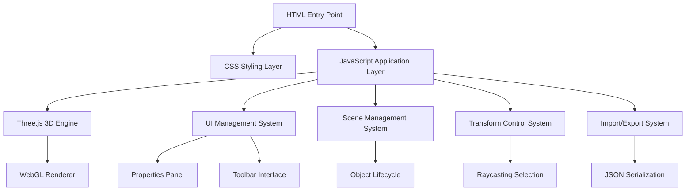

# Design Document

## Overview

The 3D Blockout Toolkit Enhancement project builds upon the existing comprehensive web-based 3D modeling tool to create a complete, production-ready solution for rapid prototyping and level design. The current implementation already provides a solid foundation with Three.js integration, modern UI, and core 3D functionality. This design focuses on enhancing the existing architecture while maintaining its simplicity and performance.

The toolkit follows a modular, object-oriented architecture using ES6 modules and modern web standards. The design emphasizes maintainability, extensibility, and cross-platform compatibility while keeping the deployment model simple (static web application with CDN dependencies).

## Architecture

### High-Level Architecture



### Core Architecture Principles

1. **Single Page Application**: All functionality contained in one HTML file with modular JavaScript
2. **ES6 Module System**: Modern import/export for code organization
3. **Component-Based UI**: Logical separation of UI concerns
4. **Event-Driven Architecture**: Loose coupling through event listeners
5. **Static Deployment**: No server-side dependencies, CDN-based external libraries

### Technology Stack Integration

- **Three.js v0.158.0**: Core 3D engine with OrbitControls and TransformControls
- **WebGL**: Hardware-accelerated rendering
- **CSS Grid/Flexbox**: Responsive layout system
- **Font Awesome**: Consistent iconography
- **ES6+ JavaScript**: Modern language features without transpilation

## Components and Interfaces

### 1. Core Application Class (BlockoutToolkit)

**Purpose**: Main application controller that orchestrates all subsystems

**Key Properties**:
- Scene management (scene, camera, renderer)
- Control systems (OrbitControls, TransformControls)
- Object tracking (objects array, selectedObject)
- State management (currentMode, gridVisible, snapToGrid)

**Key Methods**:
- `init()`: Initialize Three.js components and UI
- `addPrimitive(type)`: Create and add 3D objects
- `selectObject(object)`: Handle object selection and UI updates
- `setTransformMode(mode)`: Switch between move/rotate/scale modes

### 2. 3D Scene Management System

**Purpose**: Manages the Three.js scene, lighting, and rendering pipeline

**Components**:
- **Scene Setup**: Background, lighting configuration
- **Camera System**: PerspectiveCamera with responsive aspect ratio
- **Lighting Rig**: Ambient + directional + fill light setup
- **Grid System**: Reference grid with toggle functionality
- **Shadow System**: Soft shadow mapping for depth perception

**Interface**:
```javascript
// Scene management methods
setupLighting()
setupGrid()
onWindowResize()
render()
animate()
```

### 3. Object Management System

**Purpose**: Handles 3D object lifecycle, selection, and manipulation

**Object Data Structure**:
```javascript
mesh.userData = {
    type: 'cube|sphere|cylinder|plane',
    name: 'user_defined_name',
    id: 'unique_identifier'
}
```

**Key Features**:
- Primitive creation with random positioning and colors
- Object selection via raycasting
- Transform controls integration
- Memory management (geometry/material disposal)

### 4. Transform Control System

**Purpose**: Provides interactive 3D manipulation tools

**Components**:
- **TransformControls**: Three.js gizmo system
- **Mode Switching**: Translate, rotate, scale modes
- **Snap to Grid**: Optional grid alignment
- **Real-time Updates**: Live property panel synchronization

**Interface**:
```javascript
setTransformMode(mode)
snapObjectToGrid(object)
toggleSnapToGrid()
```

### 5. User Interface System

**Purpose**: Manages all UI interactions and property editing

**Components**:
- **Toolbar**: Tool selection and primitive creation
- **Properties Panel**: Real-time object property editing
- **Viewport Info**: Object count and selection status
- **Header Actions**: Scene management operations

**Property Panel Interface**:
- Object naming
- Position (X, Y, Z) with numeric inputs
- Rotation (X, Y, Z) in degrees
- Scale (X, Y, Z) with minimum constraints
- Color picker for material color
- Delete button

### 6. Import/Export System

**Purpose**: Scene serialization and file management

**Data Format**:
```javascript
{
    objects: [
        {
            type: 'cube',
            name: 'cube_1',
            id: 'obj_abc123',
            position: [x, y, z],
            rotation: [x, y, z],
            scale: [x, y, z],
            color: 0xffffff,
            material: {
                opacity: 1.0,
                wireframe: false,
                preset: 'default'
            }
        }
    ],
    camera: {
        position: [x, y, z],
        target: [x, y, z]
    },
    metadata: {
        version: '1.0',
        created: timestamp,
        modified: timestamp
    }
}
```

**Features**:
- JSON-based scene format with enhanced material data
- Camera state preservation
- Multiple export formats (JSON, OBJ)
- File download/upload handling
- Error handling for malformed files
- Export settings dialog for format selection

### 7. Command System (Undo/Redo)

**Purpose**: Provides undo/redo functionality for all user actions

**Command Pattern Architecture**:
```javascript
class Command {
    execute() { /* Override in subclasses */ }
    undo() { /* Override in subclasses */ }
    getDescription() { /* Return command description */ }
}

class CommandHistory {
    constructor(maxSize = 50) {
        this.history = [];
        this.currentIndex = -1;
        this.maxSize = maxSize;
    }
    
    execute(command) { /* Execute and add to history */ }
    undo() { /* Undo last command */ }
    redo() { /* Redo next command */ }
}
```

**Command Types**:
- CreateObjectCommand
- DeleteObjectCommand
- TransformObjectCommand
- PropertyChangeCommand
- MultiObjectCommand

**Features**:
- Command history with configurable size limit
- Keyboard shortcuts (Ctrl+Z, Ctrl+Y)
- UI buttons with enabled/disabled states
- Command descriptions for tooltips

### 8. Multi-Selection System

**Purpose**: Enables selection and manipulation of multiple objects

**Selection Management**:
```javascript
class SelectionManager {
    constructor() {
        this.selectedObjects = new Set();
        this.selectionBox = null; // For area selection
    }
    
    addToSelection(object) { /* Add object to selection */ }
    removeFromSelection(object) { /* Remove from selection */ }
    clearSelection() { /* Clear all selections */ }
    getSelectedObjects() { /* Return array of selected objects */ }
}
```

**Features**:
- Ctrl+click for multiple selection
- Selection box tool for area selection
- Visual feedback for selected objects
- Group operations (transform, delete, color change)
- Properties panel adaptation for multiple selections

### 9. Enhanced Material System

**Purpose**: Advanced material and visual options

**Material Properties**:
```javascript
class MaterialManager {
    constructor() {
        this.presets = {
            default: { color: 0xffffff, opacity: 1.0 },
            metal: { color: 0x888888, opacity: 1.0, metalness: 0.8 },
            wood: { color: 0x8B4513, opacity: 1.0 },
            plastic: { color: 0xffffff, opacity: 0.9 }
        };
    }
    
    applyMaterial(object, properties) { /* Apply material properties */ }
    toggleWireframe(object) { /* Toggle wireframe mode */ }
    setOpacity(object, opacity) { /* Set material opacity */ }
}
```

**Viewport Display Modes**:
- Solid shading (default)
- Wireframe view for entire scene
- Flat vs smooth shading options
- Background color customization

### 10. Measurement and Alignment Tools

**Purpose**: Precision tools for accurate positioning

**Measurement System**:
```javascript
class MeasurementTool {
    constructor() {
        this.measurementLines = [];
        this.distanceLabels = [];
    }
    
    measureDistance(object1, object2) { /* Calculate and display distance */ }
    showMeasurement(start, end) { /* Display measurement line and label */ }
    clearMeasurements() { /* Remove all measurements */ }
}
```

**Alignment Tools**:
- Align to grid functionality
- Align objects to each other (center, edges)
- Distribute objects with even spacing
- Snap to object centers or edges

### 11. View Mode System (2D/3D Switching)

**Purpose**: Provides seamless switching between 2D and 3D view modes for different workflow needs

**View Mode Architecture**:
```javascript
class ViewModeManager {
    constructor(scene, camera, renderer) {
        this.scene = scene;
        this.camera = camera;
        this.renderer = renderer;
        this.currentMode = '3d'; // '2d' or '3d'
        this.camera2D = null;    // Orthographic camera for 2D view
        this.camera3D = null;    // Perspective camera for 3D view
        this.object2DRepresentations = new Map(); // 2D sprites/outlines
    }
    
    switchTo2D() { /* Switch to orthographic top-down view */ }
    switchTo3D() { /* Switch to perspective 3D view */ }
    syncObjectRepresentations() { /* Keep 2D and 3D objects in sync */ }
    createObject2DRepresentation(object) { /* Create 2D sprite for object */ }
}
```

**Key Features**:
- **Dual Camera System**: Separate orthographic (2D) and perspective (3D) cameras
- **Object Synchronization**: Changes in one view automatically reflect in the other
- **2D Object Representations**: Simplified top-down sprites/outlines for 2D view
- **View State Persistence**: Camera positions and settings saved for each mode
- **Smooth Transitions**: Animated transitions between view modes
- **Mode-Specific Controls**: Optimized transform controls for each view mode

**2D View Characteristics**:
- Orthographic top-down camera projection
- Grid-based snapping optimized for layout planning
- Simplified 2D transform controls (position, scale only)
- Object outlines or sprite representations
- Enhanced grid visibility and snapping
- Simplified UI for layout-focused workflow

**3D View Characteristics**:
- Perspective camera with full 3D navigation
- Complete transform controls (position, rotation, scale)
- Full 3D object rendering with materials and lighting
- Orbit controls for camera manipulation
- Advanced visual features (shadows, materials, etc.)

**Data Synchronization**:
```javascript
class ViewSynchronizer {
    constructor() {
        this.objectMappings = new Map(); // 3D object -> 2D representation
    }
    
    syncObject3DTo2D(object3D) {
        // Update 2D representation based on 3D object changes
        const object2D = this.objectMappings.get(object3D);
        object2D.position.set(object3D.position.x, object3D.position.z);
        object2D.scale.set(object3D.scale.x, object3D.scale.z);
    }
    
    syncObject2DTo3D(object2D) {
        // Update 3D object based on 2D representation changes
        const object3D = this.getObject3DFromMapping(object2D);
        object3D.position.x = object2D.position.x;
        object3D.position.z = object2D.position.y;
        object3D.scale.x = object2D.scale.x;
        object3D.scale.z = object2D.scale.y;
    }
}
```

### 12. Enhanced 2D/3D UX Integration System

**Purpose**: Provides a professional CAD-like 2D design experience with seamless 3D integration, addressing the current limitations of the basic sketch mode

**Current State Analysis**:
The existing 2D sketch mode has several limitations:
- Basic drawing tools with limited precision
- Poor visual feedback and professional appearance
- Weak integration between 2D sketches and 3D object generation
- Limited shape recognition and conversion capabilities
- Lack of measurement and alignment tools in 2D mode

**Enhanced 2D Design Architecture**:
```javascript
class Enhanced2DDesignSystem {
    constructor(toolkit) {
        this.toolkit = toolkit;
        this.canvas2D = null;
        this.ctx = null;
        this.drawingEngine = new ProfessionalDrawingEngine();
        this.shapeRecognition = new IntelligentShapeRecognition();
        this.symbolLibrary = new CADSymbolLibrary();
        this.measurementSystem = new Precision2DMeasurement();
        this.layerManager = new LayerManager();
        this.gridSystem = new PrecisionGridSystem();
        this.snapSystem = new AdvancedSnapSystem();
    }
}
```

**Professional Drawing Engine**:
```javascript
class ProfessionalDrawingEngine {
    constructor() {
        this.tools = {
            precision_line: new PrecisionLineTool(),
            smart_rectangle: new SmartRectangleTool(),
            intelligent_circle: new IntelligentCircleTool(),
            dimension_tool: new DimensionTool(),
            annotation_tool: new AdvancedAnnotationTool(),
            symbol_placement: new SymbolPlacementTool()
        };
        this.drawingState = {
            currentTool: 'precision_line',
            snapEnabled: true,
            gridVisible: true,
            measurementsVisible: true,
            currentLayer: 'default'
        };
    }
    
    drawWithPrecision(startPoint, endPoint, constraints) {
        // Professional drawing with snap points, constraints, and measurements
    }
    
    showRealTimeDimensions(shape) {
        // Display dimensions as user draws
    }
    
    applyIntelligentConstraints(shape) {
        // Auto-apply common architectural constraints (parallel, perpendicular, etc.)
    }
}
```

**Intelligent Shape Recognition**:
```javascript
class IntelligentShapeRecognition {
    constructor() {
        this.recognitionPatterns = {
            rectangle: new RectanglePattern(),
            circle: new CirclePattern(),
            line: new LinePattern(),
            polygon: new PolygonPattern()
        };
        this.conversionRules = new Shape2DTo3DRules();
    }
    
    analyzeDrawnShape(pathPoints) {
        // Analyze drawn path and suggest geometric shape
        const recognizedShape = this.identifyShape(pathPoints);
        return {
            type: recognizedShape.type,
            confidence: recognizedShape.confidence,
            suggestedCorrection: recognizedShape.correctedGeometry,
            recommended3DObject: this.conversionRules.suggest(recognizedShape)
        };
    }
    
    convertTo3DObject(shape2D, conversionContext) {
        // Convert 2D shape to appropriate 3D object with context-aware properties
        const rules = this.conversionRules.getRules(conversionContext);
        return {
            type: rules.objectType,
            dimensions: rules.calculateDimensions(shape2D),
            position: rules.calculatePosition(shape2D),
            material: rules.suggestMaterial(conversionContext)
        };
    }
}
```

**CAD Symbol Library**:
```javascript
class CADSymbolLibrary {
    constructor() {
        this.symbols = {
            // Architectural symbols
            wall: new WallSymbol(),
            door: new DoorSymbol(),
            window: new WindowSymbol(),
            stairs: new StairsSymbol(),
            
            // Furniture symbols
            table: new TableSymbol(),
            chair: new ChairSymbol(),
            bed: new BedSymbol(),
            
            // 3D primitive symbols
            cube: new CubeSymbol(),
            sphere: new SphereSymbol(),
            cylinder: new CylinderSymbol(),
            cone: new ConeSymbol()
        };
        this.symbolPalette = new SymbolPalette();
    }
    
    renderSymbol(symbolType, position, scale, rotation) {
        // Render professional CAD-style symbol
        const symbol = this.symbols[symbolType];
        return symbol.render(position, scale, rotation);
    }
    
    getSymbol3DMapping(symbolType) {
        // Get corresponding 3D object configuration
        return this.symbols[symbolType].get3DMapping();
    }
}
```

**Precision Measurement System**:
```javascript
class Precision2DMeasurement {
    constructor() {
        this.measurementLines = [];
        this.dimensionLabels = [];
        this.alignmentGuides = [];
        this.units = 'meters'; // or 'feet', 'inches'
    }
    
    showRealTimeMeasurements(shape) {
        // Display measurements as user draws/modifies shapes
        const dimensions = this.calculateDimensions(shape);
        this.displayDimensionLabels(dimensions);
        this.showAlignmentGuides(shape);
    }
    
    enableSmartDimensions() {
        // Automatically show relevant dimensions based on context
        // Similar to professional CAD software
    }
    
    createMeasurementBetweenObjects(obj1, obj2) {
        // Create persistent measurement line between objects
        const distance = this.calculateDistance(obj1, obj2);
        const measurementLine = new MeasurementLine(obj1, obj2, distance);
        this.measurementLines.push(measurementLine);
        return measurementLine;
    }
}
```

**Advanced Layer Management**:
```javascript
class LayerManager {
    constructor() {
        this.layers = {
            'structure': { visible: true, locked: false, color: '#FF0000' },
            'furniture': { visible: true, locked: false, color: '#00FF00' },
            'annotations': { visible: true, locked: false, color: '#0000FF' },
            'measurements': { visible: true, locked: false, color: '#FFFF00' }
        };
        this.currentLayer = 'structure';
    }
    
    createLayer(name, properties) {
        this.layers[name] = properties;
    }
    
    setLayerVisibility(layerName, visible) {
        this.layers[layerName].visible = visible;
        this.refreshDisplay();
    }
    
    moveObjectToLayer(object, targetLayer) {
        object.layer = targetLayer;
        object.style = this.layers[targetLayer];
    }
}
```

**Bidirectional Synchronization System**:
```javascript
class BidirectionalSync {
    constructor() {
        this.object2DTo3DMap = new Map();
        this.object3DTo2DMap = new Map();
        this.syncRules = new SynchronizationRules();
    }
    
    sync2DTo3D(object2D, changeType) {
        const object3D = this.object2DTo3DMap.get(object2D);
        const syncRule = this.syncRules.getRule(changeType);
        syncRule.apply2DTo3D(object2D, object3D);
        
        // Trigger 3D viewport update
        this.toolkit.render3D();
    }
    
    sync3DTo2D(object3D, changeType) {
        const object2D = this.object3DTo2DMap.get(object3D);
        const syncRule = this.syncRules.getRule(changeType);
        syncRule.apply3DTo2D(object3D, object2D);
        
        // Trigger 2D canvas update
        this.toolkit.render2D();
    }
    
    maintainConsistency() {
        // Ensure all objects remain synchronized
        // Handle edge cases and conflicts
    }
}
```

**Enhanced UI Components**:
```javascript
class Enhanced2DUI {
    constructor() {
        this.toolPalette = new ProfessionalToolPalette();
        this.propertiesPanel = new Enhanced2DPropertiesPanel();
        this.layerPanel = new LayerManagementPanel();
        this.measurementPanel = new MeasurementControlPanel();
        this.symbolLibraryPanel = new SymbolLibraryPanel();
    }
    
    createProfessionalInterface() {
        // Create CAD-like interface with:
        // - Tool palette with professional icons
        // - Properties panel with precise numeric inputs
        // - Layer management panel
        // - Symbol library browser
        // - Measurement and dimension controls
    }
}
```

**Key Enhancements Over Current Implementation**:

1. **Professional Drawing Tools**:
   - Precision line tool with snap points
   - Smart rectangle/circle tools with constraints
   - Dimension and annotation tools
   - Symbol placement from library

2. **Intelligent Shape Recognition**:
   - Converts freehand sketches to precise geometry
   - Context-aware 3D object suggestions
   - Confidence-based correction suggestions

3. **CAD-Like Features**:
   - Layer management system
   - Professional symbol library
   - Real-time measurements and dimensions
   - Advanced snapping and alignment

4. **Seamless 3D Integration**:
   - Bidirectional synchronization
   - Context-aware 3D object generation
   - Instant preview of 3D results
   - Consistent object properties across modes

5. **Professional UI/UX**:
   - CAD-inspired interface design
   - Precise numeric inputs
   - Professional tool organization
   - Industry-standard workflows

## Data Models

### 1. Scene Object Model

```javascript
class SceneObject {
    constructor(type, geometry, material) {
        this.mesh = new THREE.Mesh(geometry, material);
        this.mesh.userData = {
            type: type,
            name: `${type}_${counter}`,
            id: generateId()
        };
        this.mesh.castShadow = true;
        this.mesh.receiveShadow = true;
    }
}
```

### 2. Application State Model

```javascript
class ApplicationState {
    constructor() {
        this.objects = [];           // Array of scene objects
        this.selectedObjects = new Set(); // Multiple selected objects
        this.objectCounter = 0;      // Auto-increment counter
        this.currentMode = 'translate'; // Transform mode
        this.gridVisible = true;     // Grid visibility state
        this.snapToGrid = false;     // Grid snapping state
        this.gridSize = 1;          // Grid unit size
        this.viewportMode = 'solid'; // Viewport display mode
        this.commandHistory = null;  // Command history for undo/redo
        this.measurementMode = false; // Measurement tool active
        this.mobileUICollapsed = false; // Mobile UI state
        this.currentViewMode = '3d'; // Current view mode ('2d' or '3d')
        this.camera2DState = null;   // Saved 2D camera state
        this.camera3DState = null;   // Saved 3D camera state
    }
}
```

### 3. Scene Data Model (Serialization)

```javascript
class SceneData {
    constructor() {
        this.objects = [];    // Serialized object data
        this.camera = {       // Camera state for 3D view
            position: [x, y, z],
            target: [x, y, z]
        };
        this.camera2D = {     // Camera state for 2D view
            position: [x, y, z],
            zoom: 1.0,
            target: [x, z]    // 2D target (X, Z plane)
        };
        this.viewMode = '3d'; // Current view mode
        this.metadata = {     // Scene metadata
            version: '1.0',
            created: timestamp,
            modified: timestamp
        };
    }
}
```

## Error Handling

### 1. User Input Validation

**Property Panel Inputs**:
- Numeric validation for position, rotation, scale
- Minimum value constraints (scale > 0.1)
- Real-time validation feedback
- Graceful fallback to previous values

**File Operations**:
- JSON parsing error handling
- File format validation
- User-friendly error messages
- Confirmation dialogs for destructive operations

### 2. 3D Engine Error Handling

**WebGL Context**:
- Context loss detection and recovery
- Fallback rendering options
- Performance degradation warnings
- Memory management for large scenes

**Three.js Integration**:
- Geometry creation error handling
- Material property validation
- Transform constraint enforcement
- Camera boundary checking

### 3. Browser Compatibility

**Feature Detection**:
- WebGL support checking
- ES6 module support validation
- File API availability
- Touch event detection for mobile

**Graceful Degradation**:
- Reduced quality settings for low-end devices
- Alternative input methods for touch devices
- Responsive layout adjustments
- Performance optimization based on device capabilities

## Testing Strategy

### 1. Unit Testing Approach

**Core Functionality Tests**:
- Object creation and deletion
- Transform operations
- Property updates
- Scene serialization/deserialization

**Test Structure**:
```javascript
// Example test cases
describe('Object Management', () => {
    test('should create cube with correct properties', () => {
        const toolkit = new BlockoutToolkit();
        toolkit.addPrimitive('cube');
        expect(toolkit.objects.length).toBe(1);
        expect(toolkit.objects[0].userData.type).toBe('cube');
    });
});
```

### 2. Integration Testing

**UI Integration**:
- Button click handlers
- Property panel updates
- Transform control interactions
- File import/export workflows

**3D Engine Integration**:
- Three.js component initialization
- Rendering pipeline validation
- Control system integration
- Memory leak detection

### 3. Cross-Platform Testing

**Device Testing Matrix**:
- Desktop browsers (Chrome, Firefox, Safari, Edge)
- Mobile browsers (iOS Safari, Android Chrome)
- Tablet interfaces
- Touch vs. mouse interaction patterns

**Performance Testing**:
- Frame rate monitoring
- Memory usage tracking
- Large scene handling (100+ objects)
- WebGL performance profiling

### 4. User Experience Testing

**Usability Scenarios**:
- New user onboarding flow
- Complex scene creation workflow
- Import/export functionality
- Error recovery scenarios

**Accessibility Testing**:
- Keyboard navigation support
- Screen reader compatibility
- Color contrast validation
- Focus management

## Performance Considerations

### 1. 3D Rendering Optimization

**Scene Optimization**:
- Object culling for large scenes
- Level-of-detail (LOD) for distant objects
- Efficient shadow mapping
- Texture memory management

**Rendering Pipeline**:
- Optimized draw calls
- Geometry instancing for repeated objects
- Material sharing where possible
- Efficient lighting calculations

### 2. Memory Management

**Object Lifecycle**:
- Proper geometry/material disposal
- Event listener cleanup
- Transform control detachment
- Scene graph optimization

**Browser Resource Management**:
- File API memory handling
- Canvas context management
- Event delegation patterns
- Efficient DOM updates

### 3. Mobile Performance

**Touch Interface Optimization**:
- Touch-friendly control sizes (minimum 44px touch targets)
- Gesture recognition (pinch-to-zoom, swipe navigation)
- Reduced rendering quality on mobile devices
- Battery usage optimization
- Collapsible UI panels for small screens

**Responsive Performance**:
- Adaptive quality settings based on device capabilities
- Reduced shadow quality on mobile
- Simplified materials for low-end devices
- Efficient viewport updates
- Performance monitoring with FPS counter
- Automatic quality adjustment for scenes with >100 objects

### 4. Enhanced Mobile Support

**Touch Controls**:
- Larger transform gizmos for touch interaction
- Touch-based object selection with visual feedback
- Swipe gestures for tool switching
- Pinch-to-zoom camera controls
- Long-press for context menus

**Mobile UI Adaptations**:
- Collapsible properties panel
- Simplified toolbar for small screens
- Touch-optimized color picker
- Gesture-based camera navigation
- Responsive breakpoints for different screen sizes

## Security Considerations

### 1. File Upload Security

**Input Validation**:
- JSON schema validation
- File size limits
- Content type verification
- Malicious content detection

**Data Sanitization**:
- Property value bounds checking
- String input sanitization
- Numeric value validation
- Object reference validation

### 2. Client-Side Security

**XSS Prevention**:
- Safe DOM manipulation
- Input sanitization
- Content Security Policy headers
- Secure external resource loading

**Data Privacy**:
- Local storage security
- No server-side data transmission
- User consent for file operations
- Secure CDN resource loading